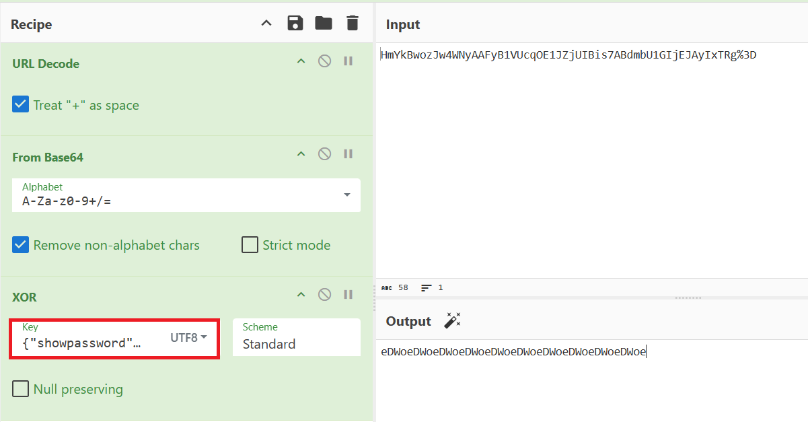
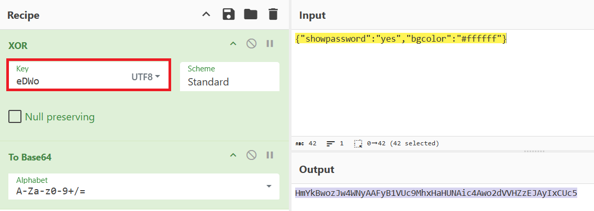

# Natas Level 11 Writeup (natas11) – OverTheWire

## Overview

This level focuses on breaking a weak encryption scheme (XOR) used in cookies to escalate privileges.        
The goal is to find the password for the next level.

## Observation

When we open the page, we see a message:

> **"Cookies are protected with XOR encryption"**

There is also a link to view the source code:

```
index-source.html
```

## Finding the Password

### Using Browser
1. Open the source code.
2. It shows the `PHP` logic used:
    ```php
    <?
    $defaultdata = array( "showpassword"=>"no", "bgcolor"=>"#ffffff");

    function xor_encrypt($in) {
        $key = '<censored>';
        $text = $in;
        $outText = '';

        // Iterate through each character
        for($i=0;$i<strlen($text);$i++) {
        $outText .= $text[$i] ^ $key[$i % strlen($key)];
        }

        return $outText;
    }

    function saveData($d) {
        setcookie("data", base64_encode(xor_encrypt(json_encode($d))));
    }

    if($data["showpassword"] == "yes") {
        print "The password for natas12 is <censored><br>";
    }
    ?>
    ```
3. The application stores data in an encrypted cookie:
   ```
   data = HmYkBwozJw4WNyAAFyB1VUcqOE1JZjUIBis7ABdmbU1GIjEJAyIxTRg%3D
   ```
4. Recover the XOR Key:

    - We know the application uses XOR encryption and the default plaintext structure get by running:

        ```
        <?php
        $defaultdata = array( "showpassword"=>"no", "bgcolor"=>"#ffffff");
        echo json_encode($defaultdata) 
        ?>
        ```
        We got default plaintext:
        ```json
        {"showpassword":"no","bgcolor":"#ffffff"}
        ```
    - Decode the cookie using CyberChef:  
        Apply the following steps:
        - URL Decode
        - From Base64  
        - XOR (with plaintext as key)  
        
        - Don't forget to select `UTF8` in XOR
    - Recovered key:
        ```
        eDWo
        ```
5. Re-Encode cookies with modified plaintext:
    - Modify plaintext to:
        ```json
        {"showpassword":"yes","bgcolor":"#ffffff"}
        ```
    - Encode the cookie using CyberChef:  
    Apply the following steps: 
        - XOR (with Recovered key as key)  
        - To Base64
    
6. Replace the cookie with the new value and refresh the page.

    The server reveals the password.

#### Proof
```text
The password for natas12 is yZdkjAYZRd3R7tq7T5kXMjMJlOIkzDeB
```

### Using Python

```python
import requests, re, base64
from urllib.parse import unquote

session = requests.Session()
base_url = "http://natas11.natas.labs.overthewire.org/"
session.auth = ("natas11", "UJdqkK1pTu6VLt9UHWAgRZz6sVUZ3lEk")

# # step 1: Get source code file
# res = session.get(base_url)
# match = re.search(r'<a(.*?)</a>', res.text, re.DOTALL)
# print(match.group(1))

# # Step 2: Reveal php logic and XOR encryption
# from bs4 import BeautifulSoup  # install with 'pip install bs4'
# url = base_url + "index-source.html"
# res = session.get(url)
# soup = BeautifulSoup(res.text, 'html.parser')
# clean_text = soup.get_text()
# match = re.search(r'<\?(.*?)\?>', clean_text, re.DOTALL)
# print(match.group(1))

# Step 3: Fetch cookies
res = session.get(base_url)
c_data = res.cookies.get('data')
print(f'cookies : {c_data}') 

def xor_encrypt(data, key):
    return ''.join(chr(ord(data[i]) ^ ord(key[i % len(key)])) for i in range(len(data)))

# Step 4: Recover key
plaintext = '{"showpassword":"no","bgcolor":"#ffffff"}'
unquote_text = unquote(c_data)
decoded_text = base64.b64decode(unquote_text).decode()

key = xor_encrypt(decoded_text, plaintext)
print(f'Recovered key: {key}')

# modify cookies
modified_plaintext = '{"showpassword":"yes","bgcolor":"#ffffff"}'
xor_text = xor_encrypt(modified_plaintext, key[:4])  # use only unique key
data = base64.b64encode(xor_text.encode('utf-8')).decode()
print(f'modified cookies : {data}')

# Get flag
cookies = {
    'data' : data
}
session.cookies.clear()
res = session.get(base_url, cookies=cookies)
match = re.search(r'\sis\s+(.*?)<br>', res.text)
print(f'Password for next level is: {match.group(1)}')
```

## Vulnerability

Weak encryption (XOR with a static key) allows attackers to recover the key and manipulate encrypted data.

## Flag
`yZdkjAYZRd3R7tq7T5kXMjMJlOIkzDeB`
